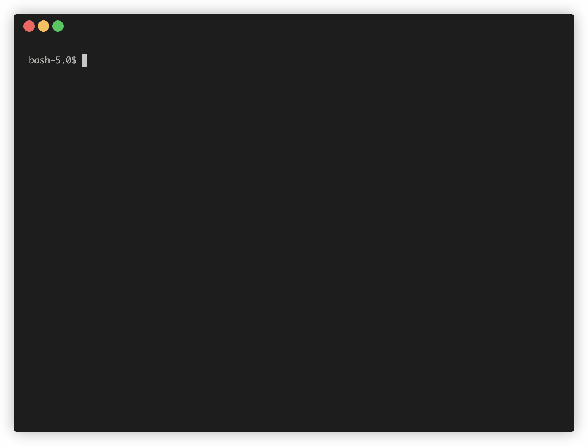

# yarn-scripts-bash-completion

yarn-scripts-bash-completion is a little helper for developers who frequently switch between Yarn projects. It adds all commands from the scripts section of the package.json in your current directory to bash completion.

## Installation

Download the file to your folder of your choice and add following line to your ~/.bashrc file:

```bash
if [ -f /path/to/your/yarn-scripts.bash-completion ]; then
   . /path/to/your/yarn-scripts.bash-completion
fi
```

## Demo


